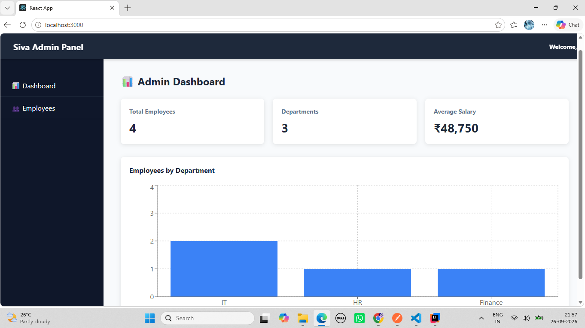
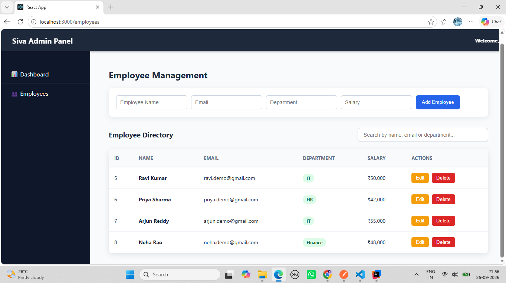
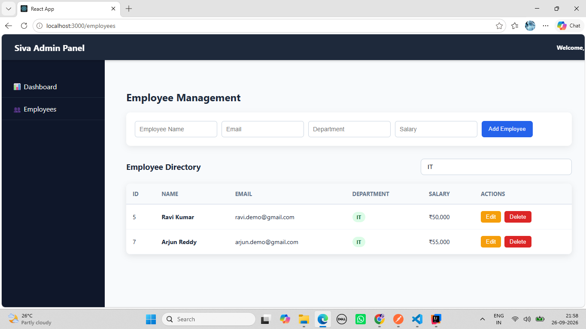

# React Admin Dashboard

A React-based employee management dashboard integrated with a Spring Boot REST API and MySQL database.

The application provides employee CRUD operations, search functionality, and a dashboard that displays employee statistics using data fetched from the backend.

## Features

- Employee management with Create, Read, Update, and Delete operations
- Search employees by name, email, or department
- Dashboard with employee statistics
- Total employee count
- Total department count
- Average employee salary
- Department-wise employee visualization using Recharts
- REST API integration using Axios
- Client-side navigation using React Router
- Functional components and React Hooks
- Reusable service layer for API communication

## Tech Stack

- React.js
- JavaScript
- React Hooks
- Axios
- React Router DOM
- Recharts
- HTML5
- CSS3
- Spring Boot REST API
- MySQL

## Application Structure

```text
src/
├── components/
│   ├── Navbar.js
│   └── Sidebar.js
├── pages/
│   ├── Dashboard.js
│   └── Employees.js
├── services/
│   └── employeeService.js
├── App.js
└── index.js
```

## Employee Management

The Employees page communicates with the Spring Boot backend and supports:

- Add employee
- View employee list
- Update employee
- Delete employee
- Search employees

Employee data includes:

- Name
- Email
- Department
- Salary

## Dashboard

The dashboard retrieves employee data from the backend and calculates:

- Total Employees
- Total Departments
- Average Salary
- Employees by Department

Department-wise employee counts are displayed using a Recharts bar chart.

## Backend Integration

The frontend communicates with the Employee Management REST API through Axios.

Backend API:

```text
http://localhost:8087/api/employees
```

Supported operations:

```text
GET    /api/employees
GET    /api/employees/{id}
POST   /api/employees
PUT    /api/employees/{id}
DELETE /api/employees/{id}
```

## Project Screenshots

### Dashboard



### Employee Management



### Employee Search



## Running the Application

### 1. Clone the repository

```bash
git clone https://github.com/gummadi-venkata-sivanagi-reddy/react-admin-dashboard.git
```

### 2. Install dependencies

```bash
npm install
```

### 3. Start the Backend

Run the Employee Management Spring Boot REST API on port:

```text
8087
```

### 4. Start the Frontend

```bash
npm start
```

The application runs at:

```text
http://localhost:3000
```

## Related Backend Project

This frontend application works with the Employee Management REST API built using Spring Boot, Spring Data JPA, Hibernate, and MySQL.

---

**Developed by Siva Reddy | Java Full Stack Developer**
